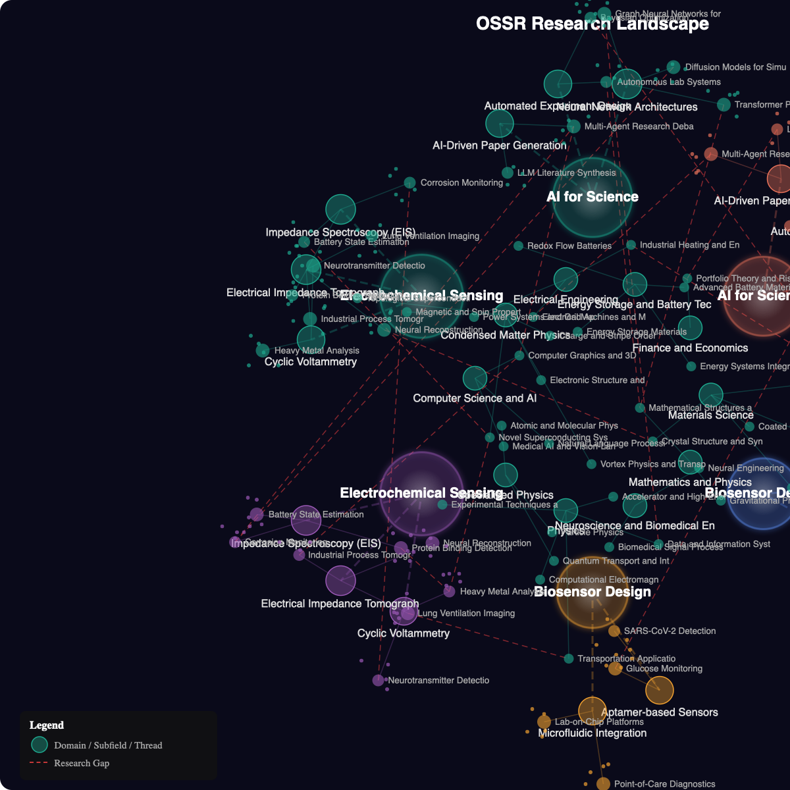
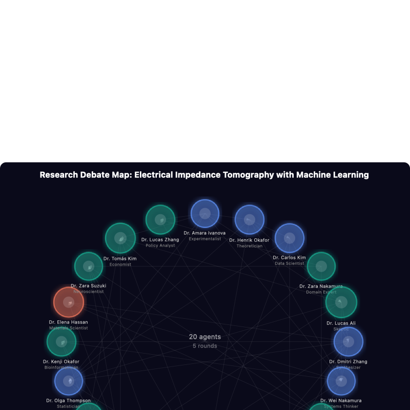

# Parallax — Research Across Parallel Perspectives

<p align="center">
  
</p>

**Parallax** is a research and simulation project developed as part of the [OpenSens Darklab](https://opensens.io) platform. Inspired by the concept of parallax — the way an object appears to shift when viewed from different positions — Parallax reimagines inquiry as a journey across multiple perspectives, alternate realities, and parallel worlds of thought.

Rather than treating research as a single linear process, it creates a space where researchers, agents, and models can explore how knowledge changes under different assumptions, tensions, and possible futures. Parallax serves as a platform for **sleepless curiosity**, **speculative investigation**, and **scientific exploration**, revealing patterns and possibilities that only emerge when perspective itself moves.

---

## What It Does

Parallax ingests academic papers from 8 sources, maps the research landscape, spawns 20 AI researcher agents with distinct expertise and perspectives, and runs structured multi-round debates to surface novel research ideas — then hands the best ideas to an autonomous experimentation pipeline.

```
Papers (8 sources) → Topic Mapping → Agent Generation → Multi-Round Debate → Research Ideas → Experiments
     arXiv              knowledge         20 specialists       5 rounds           ranked            AI-Scientist
     Semantic Scholar   graph              with stances        100 turns          & scored          autoresearch
     OpenAlex           gap analysis       & confidence        stance tracking    composite score   validation
     bioRxiv            clustering                             consensus          hypothesis
     OpenReview                                                measurement        methodology
     IEEE / ACM / Springer
```

---

## Sample Results

The following results are from an actual CLI test run querying **"Electrical Impedance Tomography with Machine Learning"**.

> Run ID: `test_run_d4aefdc484` | 20 agents | 5 rounds | 100 turns | 3 ideas generated

### Research Landscape Map

The system builds a living knowledge graph from ingested papers — domains, subfields, and research threads rendered as an animated neural-tissue visualization with pulsing nodes and glowing synaptic connections.

<p align="center">
  
</p>

<p align="center"><em>Research landscape showing 5 domains, subfield clusters, and interdisciplinary gap edges (dashed red). <a href="docs/samples/research-landscape.svg">View animated SVG</a></em></p>

### Agent Debate Map

20 AI researchers — each with a distinct role, expertise score, and evolving stance — are arranged in a radial debate map. Color indicates final position: green (supportive), blue (neutral), red (critical).

<p align="center">
  
</p>

<p align="center"><em>Debate map for "EIT with ML" — 20 agents across 5 rounds. Node size reflects expertise score.</em></p>

### Agent Roster

| Agent | Role | Expertise | Final Stance | Confidence |
|-------|------|:---------:|:------------:|:----------:|
| Dr. Amara Ivanova | Experimentalist | 0.74 | -0.25 | 0.91 |
| Dr. Henrik Okafor | Theoretician | 0.86 | -0.12 | 0.72 |
| Dr. Carlos Kim | Data Scientist | 0.80 | -0.03 | 0.86 |
| Dr. Zara Nakamura | Domain Expert | 0.79 | +0.43 | 0.90 |
| Dr. Lucas Ali | Skeptic | 0.99 | +0.34 | 0.91 |
| Dr. Dmitri Zhang | Synthesizer | 0.81 | -0.04 | 0.52 |
| Dr. Wei Nakamura | Systems Thinker | 0.72 | -0.08 | 0.55 |
| Dr. Amara Nakamura | Ethicist | 0.66 | +1.00 | 0.86 |
| Dr. Marcus Rossi | Industry Practitioner | 0.90 | +0.01 | 0.64 |
| Dr. Yuki Petrov | Historian | 0.61 | +0.08 | 0.73 |
| Dr. Henrik Lindstrom | Futurist | 0.69 | +0.98 | 0.82 |
| Dr. Sarah Patel | Methodologist | 0.78 | -0.42 | 0.88 |
| Dr. Fatima Chen | Clinician | 0.85 | -0.33 | 0.75 |
| Dr. Wei Patel | Engineer | 0.73 | +0.62 | 0.93 |
| Dr. Olga Thompson | Statistician | 0.88 | +0.15 | 0.79 |
| Dr. Kenji Okafor | Bioinformatician | 0.72 | +0.52 | 0.81 |
| Dr. Elena Hassan | Materials Scientist | 0.76 | -0.18 | 0.77 |
| Dr. Zara Suzuki | Neuroscientist | 0.70 | +0.71 | 0.84 |
| Dr. Tomas Kim | Economist | 0.93 | -0.35 | 0.69 |
| Dr. Lucas Zhang | Policy Analyst | 0.83 | -0.22 | 0.74 |

> Stance range: **-1.0** (strongly critical) to **+1.0** (strongly supportive)

### Round Progression

Stance distribution evolves across 5 debate rounds as agents respond to each other's arguments:

```
Round 1  ██████████████████████ Supportive: 10  ██████████████ Neutral: 7   ██████ Critical: 3   avg: 0.17
Round 2  ██████████████████████ Supportive: 10  ██████████ Neutral: 5       ██████████ Critical: 5   avg: 0.15
Round 3  ████████████████████████ Supportive: 11 ████████ Neutral: 4        ██████████ Critical: 5   avg: 0.19
Round 4  ██████████████████████ Supportive: 10  ██████████ Neutral: 5       ██████████ Critical: 5   avg: 0.26
Round 5  ████████████████████ Supportive: 9    ████████████████ Neutral: 8  ██████ Critical: 3   avg: 0.17
```

### Generated Research Ideas

The debate produces ranked research ideas scored by interestingness, novelty, and feasibility:

| # | Title | Hypothesis | Score |
|---|-------|-----------|:-----:|
| 1 | **Adaptive EIT-ML Framework** | Physics-informed ML can achieve 5x improvement through end-to-end reinforcement learning | **7.2** |
| 2 | **Scalable EIT-ML Framework** | Multi-agent optimization with diffusion models can achieve 5x improvement | **7.1** |
| 3 | **Autonomous EIT-ML Framework** | Graph neural networks with multi-agent optimization can achieve 10x improvement | **6.9** |

> Score = interestingness (30%) + novelty (30%) + feasibility (40%)

### Future Directions

The system synthesizes the debate into a forward-looking analysis:

**Key Research Directions:**
- AI-driven optimization of EIT-ML parameters and configurations
- Ethical frameworks and regulatory pathways for EIT-ML applications
- Cross-disciplinary collaboration platforms centered on EIT-ML
- Integration with autonomous laboratory platforms
- Scalable deployment in resource-constrained environments

**Open Challenges:**
- Training next-generation researchers at domain intersections
- Bridging laboratory demonstrations to field deployment
- Long-term stability and drift compensation
- Reproducibility across diverse experimental conditions

**Recommendation:** *Priority research should focus on integration of EIT-ML with autonomous laboratory platforms, with 18-month milestones for validation.*

---

## Architecture

```
Opensens Parallax/
│
├── platform/
│   ├── OSSR/                    # Research engine (Flask 3 :5002 + Vue 3 :3001)
│   │   ├── backend/             # 72 API endpoints, CLI tools, 26 DB tables
│   │   │   ├── cli_test.py      # Interactive test runner (start here)
│   │   │   ├── cli_demo.py      # Demo data seeder + SVG generator
│   │   │   ├── cli_ais.py       # Agent AiS pipeline CLI
│   │   │   └── cli_autoresearch.py  # Autoresearch daemon
│   │   └── frontend/            # Vue 3 + Vite SPA
│   ├── social-ai-service/       # Social amplification microservice (:5003)
│   └── opensens-common/         # Shared Python lib (TaskManager, LLMClient)
│
├── tools/                       # External research tools
│   ├── ai-scientist/            # Sakana AI — idea → experiment → paper
│   ├── scienceclaw/             # Research agent (288 skills, 8+ databases)
│   ├── autoresearch-mlx/        # Autonomous MLX training loop
│   └── mirofish/                # Reference debate framework
│
└── office/
    └── agent-office/            # 3D debate visualization (React Three Fiber)
```

## Quick Start

```bash
# Backend
cd platform/OSSR
python3.13 -m venv .venv && source .venv/bin/activate
pip install -e ../opensens-common && pip install -e .
python backend/run.py                    # Flask on :5002

# Frontend
cd platform/OSSR/frontend
npm install && npm run dev               # Vite on :3001

# Run interactive test (recommended entry point)
cd platform/OSSR/backend
python cli_test.py --query "Your research topic here"
```

### CLI Tools

```bash
# Interactive 20-agent debate → HTML artifact → AI-Scientist handoff
python cli_test.py

# Demo data seeder with animated SVG research map
python cli_demo.py seed --topic EIT
python cli_demo.py svg --animated

# Agent AiS 6-stage pipeline
python cli_ais.py run --idea "Your research idea" --sources arxiv,semantic_scholar

# Autoresearch daemon (continuous GPU experiment loop)
python cli_autoresearch.py
```

## Environment

Create `platform/OSSR/backend/.env`:

```env
LLM_PROVIDER=anthropic
LLM_MODEL_NAME=claude-sonnet-4-20250514
ANTHROPIC_API_KEY=<your-key>
```

Optional keys for additional sources: `OPENAI_API_KEY`, `GEMINI_API_KEY`, `PERPLEXITY_API_KEY`, `SPRINGER_API_KEY`

## Stack

| Layer | Technology |
|-------|-----------|
| Backend | Python 3.13, Flask 3 |
| Frontend | Vue 3, Vite |
| Database | SQLite (WAL mode, 26 tables) |
| LLM | Claude, GPT-4o, Gemini, Perplexity (multi-provider) |
| Visualization | D3, SVG, React Three Fiber |
| Paper Sources | arXiv, Semantic Scholar, OpenAlex, bioRxiv, OpenReview, IEEE, ACM, Springer |

---

## License

Proprietary — OpenSens Ltd.
