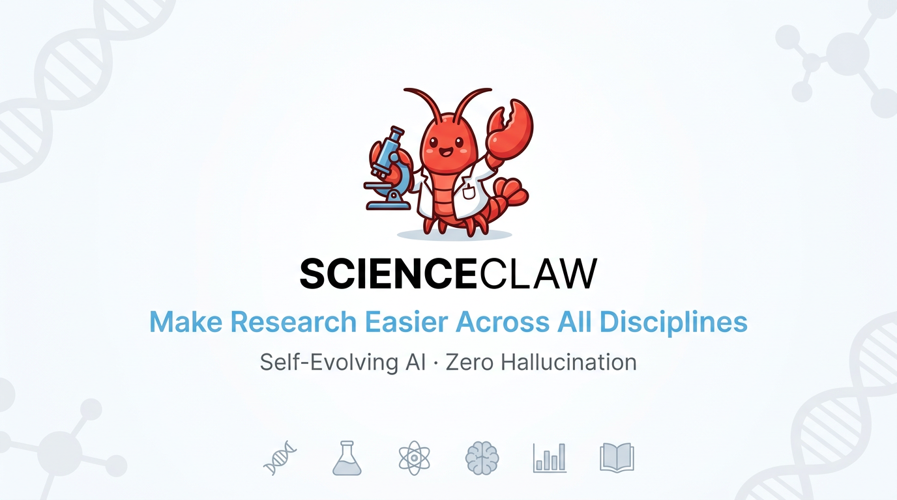
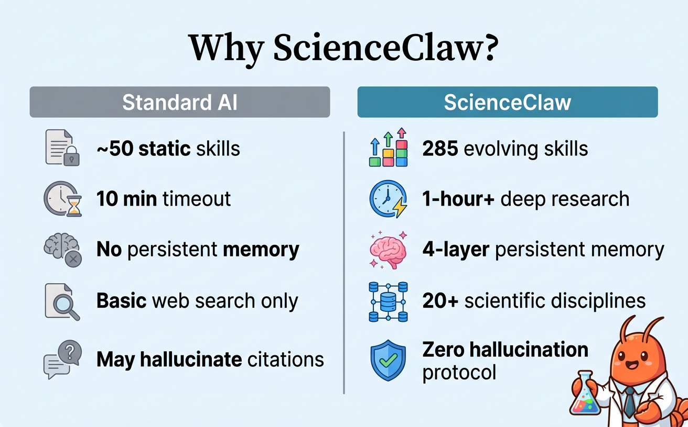
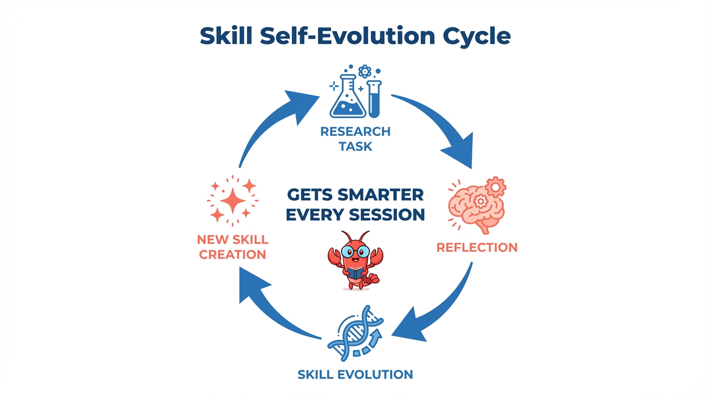
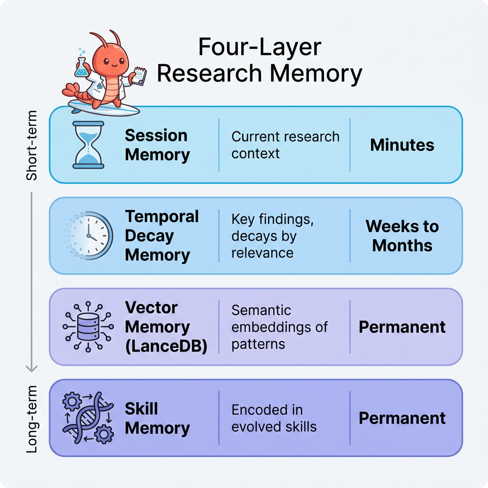
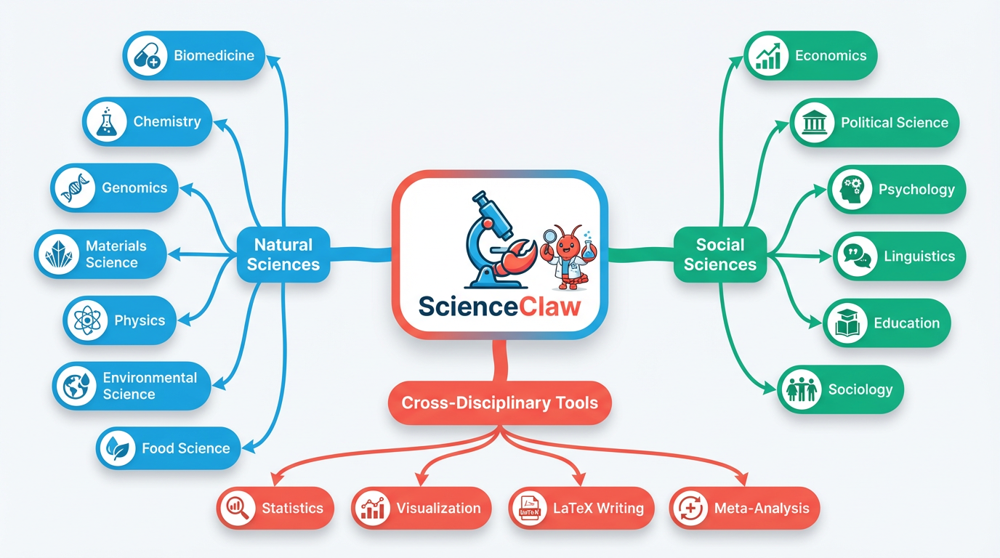

<p align="center">
  
</p>

<p align="center">
  <strong>A self-evolving AI research colleague for scientists.</strong>
</p>

<p align="center">
  
  
  
  
  
</p>

---

## Why ScienceClaw?

General-purpose AI assistants are built for everyone. ScienceClaw is built for **researchers**.

The core idea is simple: an AI that does real scientific work — searching literature, querying databases, running analyses — and **gets better at it the more you use it**. It remembers your research context across sessions, adapts its skills to your field, and never fabricates a citation.

ScienceClaw is built on the [OpenClaw](https://github.com/openclaw/openclaw) engine, but redesigned from the ground up for academic research.

<p align="center">
  
</p>

---

## 🧬 Core 1: Self-Evolving Skills

**This is ScienceClaw's most important feature.**

Most AI tools ship with a fixed set of capabilities. ScienceClaw's skills **evolve with you**. Every time you complete a research task, the system learns:

<p align="center">
  
</p>

**What this means in practice:**

- **Week 1:** You study immunology. ScienceClaw learns that PubMed + Semantic Scholar works best for your queries, that you prefer forest plots over tables, and that you always need PMID + DOI in citations.
- **Week 4:** The system has created specialized skills for your subfield — optimized search templates, preferred statistical methods, database priority chains tuned to immunology literature.
- **Month 3:** ScienceClaw handles your domain like a trained research assistant. It knows which databases to hit first, which journals matter, and how you like your output formatted.

> **Compared to standard OpenClaw:** OpenClaw ships with ~54 general-purpose skills that don't change. ScienceClaw starts with 285 skills and grows from there — the agent writes new `SKILL.md` files at runtime without any redeployment.

---

## 🧠 Core 2: Research Memory That Persists

Standard AI assistants forget everything when the conversation ends. ScienceClaw doesn't.

<p align="center">
  
</p>

**What this enables:**

- **"Continue the literature review we started last Tuesday"** — it remembers where you left off
- **"Use the same search strategy that worked for the BRCA2 project"** — it retrieves past patterns
- **Cross-session knowledge accumulation** — findings from project A can inform project B
- **Smart context pruning** — when the context window fills up, it preserves statistical results, effect sizes, and key citations while compacting intermediate steps

> **Compared to standard OpenClaw:** OpenClaw has a basic memory plugin. ScienceClaw adds temporal decay weighting, LanceDB vector storage, and cross-session research pattern retrieval — specifically designed for long-running academic work.

---

## ⏱️ Core 3: Built for Long-Duration Research

A real literature review takes hours, not seconds. Most AI tools time out after a few minutes. ScienceClaw is engineered for extended research sessions:

| Capability          | Standard OpenClaw      | ScienceClaw                                                       |
| ------------------- | ---------------------- | ----------------------------------------------------------------- |
| Agent timeout       | 600s (10 min)          | **3600s (1 hour+)**                                                |
| Session persistence | Ends with conversation | Heartbeat keeps sessions alive across interruptions               |
| Research depth      | Single-pass response   | **Multi-phase protocol with mandatory depth thresholds**          |
| Minimum effort      | No guarantee           | Quick=5, Survey=30, Review=60, Systematic=100+ tool calls         |
| Early stopping      | Common                 | **Anti-premature-conclusion checklist** blocks shallow answers    |
| Context management  | Basic truncation       | **Smart compaction** preserves key findings when context fills up |

**The persistence protocol enforces real research depth.** Before ScienceClaw concludes any task, it must verify:

- ✅ Searched at least 3 different databases/sources
- ✅ Retrieved full metadata (not just titles)
- ✅ Cross-referenced findings across sources
- ✅ Checked for contradictory evidence
- ✅ Verified key statistics against primary sources
- ✅ Organized results into a structured output file
- ✅ Met the minimum tool-call threshold for the task type

If any box is unchecked, it **keeps working** instead of giving you a half-baked answer.

> **Compared to standard OpenClaw:** OpenClaw's default 10-minute timeout is fine for sending messages and setting reminders. ScienceClaw's 1-hour sessions with heartbeat monitoring and mandatory depth enforcement are built for real academic research.

---

## 🚫 Core 4: Zero Hallucination

This is the highest-priority rule in the entire system. It's non-negotiable.

**The problem:** General AI assistants routinely fabricate citations — inventing DOIs, making up author names, citing papers that don't exist. In scientific work, this is catastrophic.

**ScienceClaw's approach:**

```
EVERY citation must come from a tool result in the CURRENT conversation.

If a database didn't return it → you can't cite it.
If you're not sure → say "not verified" explicitly.
If you can't find evidence → say so. Don't guess.

No "I think." No "probably." No hallucinated PMIDs.
```

This is enforced at the protocol level in [`SCIENCE.md`](SCIENCE.md) — the 629-line research protocol that governs all agent behavior. It's not a suggestion. It's a hard rule that applies before any other instruction.

> **Compared to standard OpenClaw:** OpenClaw has no special hallucination controls. ScienceClaw's SCIENCE.md protocol treats every factual claim as requiring evidence — the same standard you'd apply to a manuscript under peer review.

---

## 🌍 Core 5: All of Science, Not Just Biomedicine

ScienceClaw covers **natural sciences AND social sciences** across dozens of disciplines:

<p align="center">
  
</p>

<details>
<summary><strong>📋 Full discipline & database list</strong></summary>

### Natural Sciences

| Domain                    | Key Skills & Databases                                                |
| ------------------------- | --------------------------------------------------------------------- |
| **Biomedicine**           | PubMed, UniProt, KEGG, PDB, ClinicalTrials, gnomAD, scanpy, biopython |
| **Chemistry**             | PubChem, ChEMBL, RDKit, drug-discovery, molecular-dynamics            |
| **Genomics**              | NCBI Entrez, Ensembl, ClinVar, GEO, phylogenetics                     |
| **Materials Science**     | Materials Project, pymatgen, materials-screening                      |
| **Physics**               | astropy, quantum-computing, physics-solver, simulation                |
| **Environmental Science** | Copernicus climate data, geospatial analysis, GIS tools               |
| **Food Science**          | Specialized analysis pipelines                                        |

### Social Sciences

| Domain                | Key Skills & Databases                                  |
| --------------------- | ------------------------------------------------------- |
| **Economics**         | World Bank, SSRN, census data, econometrics             |
| **Political Science** | Policy analysis, legislative data                       |
| **Psychology**        | Experimental design, statistical testing, meta-analysis |
| **Linguistics**       | spaCy, NLTK, NLP analysis                               |
| **Education**         | Research methodology, assessment analysis               |
| **Sociology**         | Network analysis, survey methods                        |

### Cross-Disciplinary Tools

| Category          | Capabilities                                                                                          |
| ----------------- | ----------------------------------------------------------------------------------------------------- |
| **Statistics**    | SciPy, statsmodels, scikit-learn, effect sizes, confidence intervals, multiple comparison corrections |
| **Visualization** | matplotlib, plotly, seaborn, publication-quality figures                                              |
| **Writing**       | LaTeX papers, systematic reviews (PRISMA), grant proposals, patent drafting                           |
| **Mathematics**   | SymPy symbolic computation, numerical methods, optimization                                           |

</details>

**285 skills total** — and growing, because the self-evolution system creates new ones as you work.

> **Compared to standard OpenClaw:** OpenClaw has no scientific database integrations. No PubMed, no UniProt, no arXiv, no World Bank. ScienceClaw connects to 25+ academic databases with structured API query skills across all major scientific disciplines.

---

## Quick Start

```bash
# Clone
git clone https://github.com/beita6969/ScienceClaw.git
cd ScienceClaw

# One-click setup (installs everything: Node, Python, MCP servers, skills)
chmod +x setup.sh && ./setup.sh

# Or manual install
pnpm install && npx openclaw onboard
```

### Enable Research Features

The `setup.sh` script automatically configures everything. For manual setup, edit `~/.openclaw/openclaw.json`:

```jsonc
{
  "gateway": { "mode": "local" },
  "plugins": {
    "slots": { "memory": "memory-core" },
    "entries": {
      "memory-core": { "enabled": true },
      "memory-lancedb": { "enabled": true }
    }
  },
  "agents": {
    "defaults": {
      "heartbeat": { "interval": 1800 }
    }
  }
}
```

---

## Project Structure

```
ScienceClaw/
├── setup.sh                # 🦞 One-click setup (run this first!)
├── SCIENCE.md              # 629-line research protocol (the brain)
├── skills/                 # 285 skill definitions (and growing)
│   ├── skill-evolution/    # Self-improving skill system
│   ├── research-reflection/# Post-task learning & evaluation
│   ├── skill-creator/      # Runtime skill generation
│   └── ...
├── src/                    # Core engine
│   ├── memory/             # 4-layer memory (temporal decay, LanceDB)
│   ├── agents/             # Agent orchestration & persistence
│   └── skills/             # Skill loading & execution
├── ui/                     # Web-based research gateway UI
├── extensions/             # Plugin system
├── deploy/                 # Docker, Fly.io, Podman configs
├── config/                 # Vitest, build, lint configs
└── docs/                   # Documentation
```

## Contact Us

📧 **mingdazhang@ieee.org**

## License

MIT — see [LICENSE](LICENSE).
